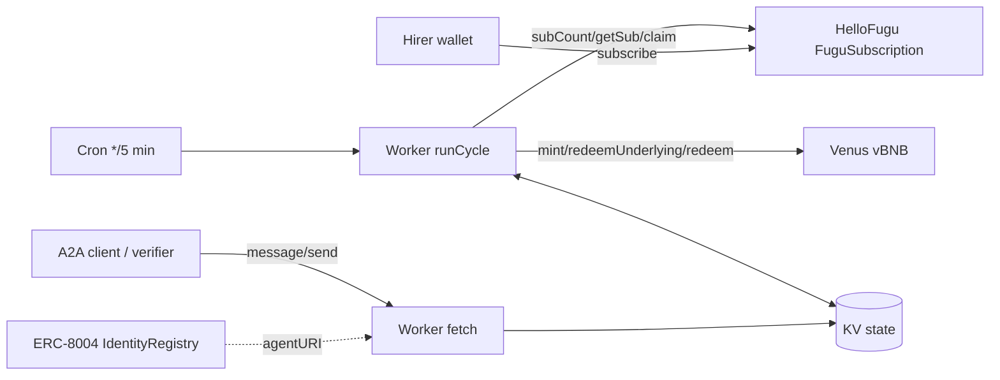

# System Architecture

State (KV key `state`): principal, last harvest day, subscription scan cursor, tracked hires, last 100 actions.
One strategy action per cycle; hires are synced first so a new hire raises the target in the same cycle.
