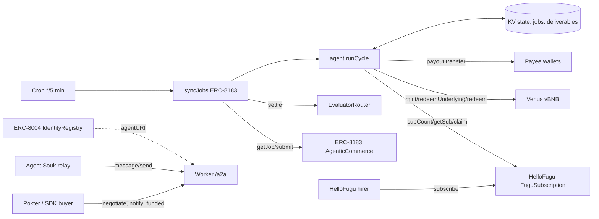

# System Architecture

Two Workers share `src/shared` and differ only in the `AgentModule` (profile, cycle, report, dashboard sections).
KV keys per Worker: `state` (agent cycle: hires, ledger, pending tx, principal, payouts), `jobs` (ERC-8183 cursor and job records), `deliverable:<jobId>` (manifest text).
The cron is the only writer of state and the only sender of transactions; HTTP handlers are read-only (quotes are signatures, not transactions), so nonces never race.
Active hires = unfinished HelloFugu subscriptions + FUNDED/SUBMITTED ERC-8183 jobs.
